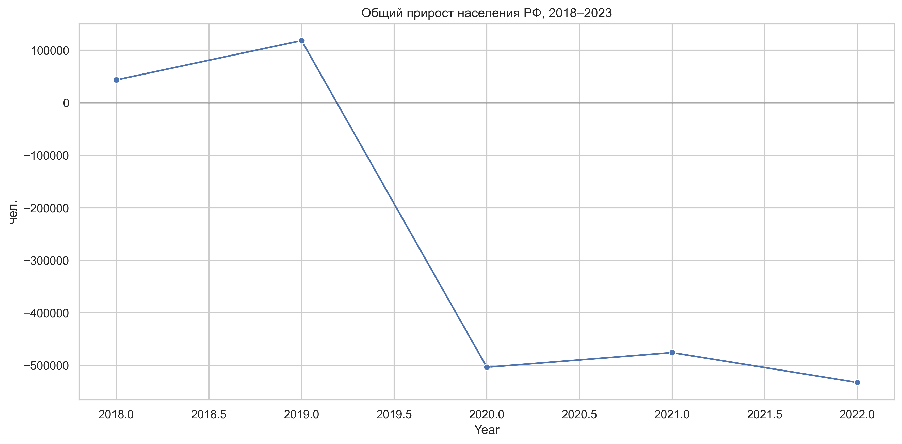
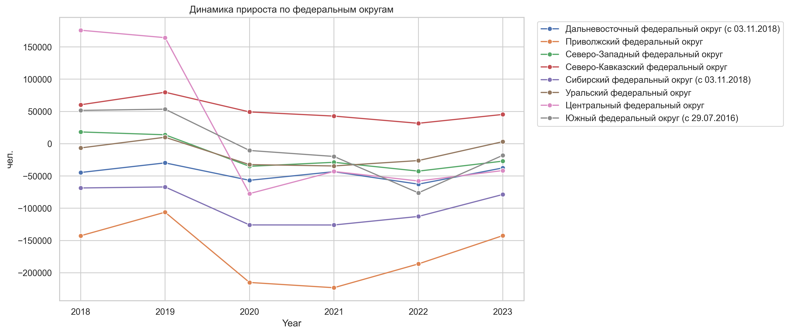
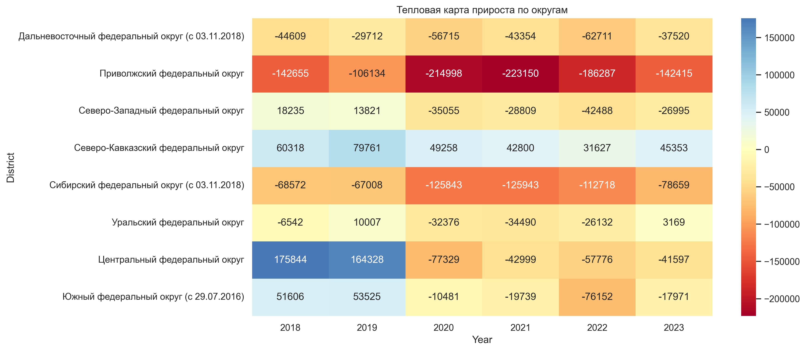
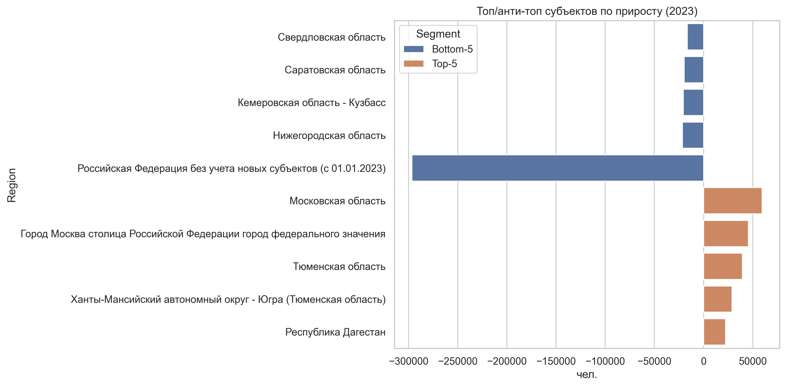
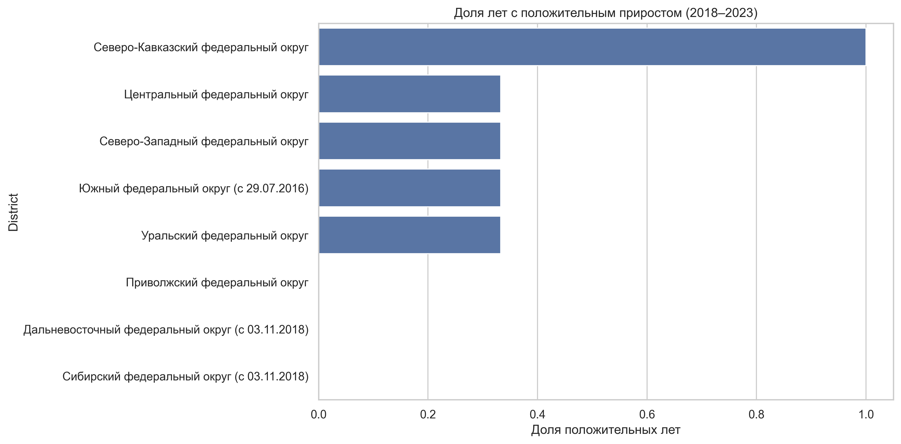

# Лабораторная работа №2, Хотинская Арина, ИС-М24

## Описание набора данных

- Источник: выгрузка Росстата «Общий прирост постоянного населения»

- Фактически доступный интервал: 2018–2023 (в исходной выгрузке нет данных за 2000–2017)

- Количество строк (Region, Year): 576

- Уникальных территорий: 97

- В том числе федеральных округов: 8

### Пример записей

|   Year | Region                                                     |   TotalGrowth |
|-------:|:-----------------------------------------------------------|--------------:|
|   2018 | Алтайский край                                             |        -27587 |
|   2018 | Амурская область                                           |         -6031 |
|   2018 | Архангельская область                                      |        -19543 |
|   2018 | Архангельская область (кроме Ненецкого автономного округа) |        -19113 |
|   2018 | Астраханская область                                       |         -6323 |
|   2018 | Белгородская область                                       |         -2053 |
|   2018 | Брянская область                                           |        -11041 |
|   2018 | Владимирская область                                       |        -10761 |
|   2018 | Волгоградская область                                      |         -9821 |
|   2018 | Вологодская область                                        |         -9082 |

## Упражнение 1. Национальная динамика

```sql
SELECT Year, TotalGrowth
FROM growth
WHERE Region = 'Российская Федерация'
ORDER BY Year
```

Линейный график показывает смену знака прироста: после пика 2019 года страна уходит в устойчивое сокращение населения.



## Упражнение 2. Федеральные округа во времени

```sql
SELECT Year, Region AS District, TotalGrowth
FROM growth
WHERE Level = 'district'
ORDER BY Year, District
```

Большинство округов показывают отрицательные значения, за исключением Северо-Кавказского округа



## Упражнение 3. Тепловая карта округов

Тепловая карта усиливает различия: Северный Кавказ и отдельные годы в ЦФО остаются зонами роста, тогда как Приволжский и Сибирский округа стабильно в минусе.



## Упражнение 4. Крайние регионы 2023 года

```sql
WITH ranked AS (
    SELECT Region,
           TotalGrowth,
           DENSE_RANK() OVER (ORDER BY TotalGrowth DESC) AS rk_pos,
           DENSE_RANK() OVER (ORDER BY TotalGrowth ASC)  AS rk_neg
    FROM growth
    WHERE Level = 'region' AND Year = 2023
)
SELECT CASE WHEN rk_pos <= 5 THEN 'Top-5' ELSE 'Bottom-5' END AS Segment,
       Region,
       TotalGrowth
FROM ranked
WHERE rk_pos <= 5 OR rk_neg <= 5
ORDER BY Segment, TotalGrowth DESC
```

| Segment   | Region                                                                |   TotalGrowth |
|:----------|:----------------------------------------------------------------------|--------------:|
| Bottom-5  | Свердловская область                                                  |        -16466 |
| Bottom-5  | Саратовская область                                                   |        -19781 |
| Bottom-5  | Кемеровская область - Кузбасс                                         |        -20554 |
| Bottom-5  | Нижегородская область                                                 |        -21482 |
| Bottom-5  | Российская Федерация без учета новых субъектов (с 01.01.2023)         |       -296635 |
| Top-5     | Московская область                                                    |         59524 |
| Top-5     | Город Москва столица Российской Федерации город федерального значения |         45626 |
| Top-5     | Тюменская область                                                     |         39566 |
| Top-5     | Ханты-Мансийский автономный округ - Югра (Тюменская область)          |         29033 |
| Top-5     | Республика Дагестан                                                   |         22443 |

Горизонтальная диаграмма подчёркивает сверхпозитивную динамику в Москве и Московской области на фоне глубокого спада в большинстве регионов Центральной России.



## Упражнение 5. Устойчивость прироста по округам

```sql
SELECT Region AS District,
       SUM(CASE WHEN TotalGrowth > 0 THEN 1 ELSE 0 END) AS PositiveYears,
       COUNT(*) AS TotalYears,
       ROUND(SUM(CASE WHEN TotalGrowth > 0 THEN 1 ELSE 0 END) / COUNT(*), 3)
           AS PositiveShare
FROM growth
WHERE Level = 'district'
GROUP BY Region
ORDER BY PositiveShare DESC
```

| District                                         |   PositiveYears |   TotalYears |   PositiveShare |
|:-------------------------------------------------|----------------:|-------------:|----------------:|
| Северо-Кавказский федеральный округ              |               6 |            6 |           1     |
| Центральный федеральный округ                    |               2 |            6 |           0.333 |
| Северо-Западный федеральный округ                |               2 |            6 |           0.333 |
| Южный федеральный округ (с 29.07.2016)           |               2 |            6 |           0.333 |
| Уральский федеральный округ                      |               2 |            6 |           0.333 |
| Приволжский федеральный округ                    |               0 |            6 |           0     |
| Дальневосточный федеральный округ (с 03.11.2018) |               0 |            6 |           0     |
| Сибирский федеральный округ (с 03.11.2018)       |               0 |            6 |           0     |

Северо-Кавказский округ остаётся единственным регионом, где все годы выборки показывают положительный прирост, тогда как большинство округов имеют долю 0.

